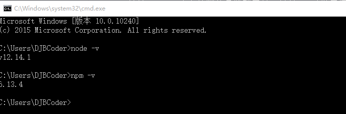
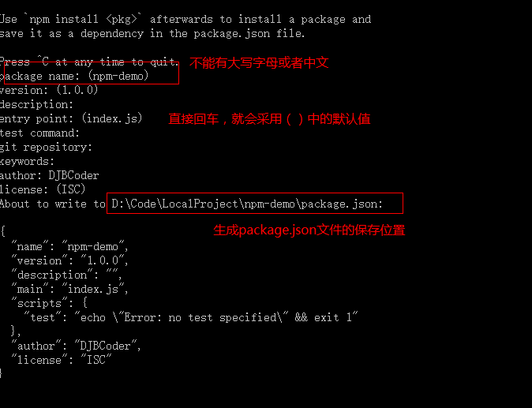
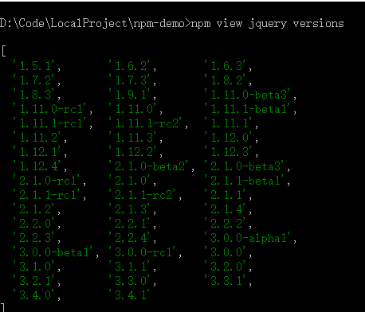

@[toc](NPM包管理工具)

# 什么是NPM
&emsp;&emsp;NPM(Node Package Manager)是JavaScript的包管理工具，并且是Node.js平台的默认包管理工具，通过NPM可以安装、共享、分发代码，管理项目依赖关系：

+ 可以从NPM服务器下载别人编写的第三方包到本地使用
+ 可以从NPM服务器下载别人编写的命令行程序到本地使用
+ 可以将自己编写的包或命令行程序上传到NPM服务器供别人使用

&emsp;&emsp;通过NPM可以很方便地安装与下载JS库，管理前端工程。最新版本的Node.js集成了npm工具，所以必须首先在本机安装Node环境（直接从官网下载安装包安装即可），安装成功后可以查看当前nodejs与npm版本：



# NPM初始化项目
&emsp;&emsp;可以通过 *__npm init__* 命令初始化项目，具体步骤如下：

1. 打开任务终端
2. 通过 *__mkdir npm-demo__* 的方式创建项目目录，并通过 *__cd npm-demo__* 进入到项目目录
3. 通过 *__npm init__* 命令来初始化项目
4. 根据提示输入相关信息（如果使用默认值，则直接回车即可；或者直接使用 *__npm init -y__* 命令初始化项目，此时均采用默认信息，不会提示手动输入信息）

+ package name：包名，其实就是项目名称（注意不能有大写字母或者中文）
+ version：项目版本号
+ description：项目描述
+ entry point：项目入口文件
+ test command：脚本命令组成的对象
+ git repository：git仓库地址
+ keywords：{Array}关键字，便于用户搜索到该项目
+ author：作者信息
+ license：许可证



5. 最后生成一个package.json文件，这个是包的配置文件，该文件可以根据需要进行修改：

```json
{
  "name": "npm-demo",
  "version": "1.0.0",
  "description": "",
  "main": "index.js",
  "scripts": {
    "test": "echo \"Error: no test specified\" && exit 1"
  },
  "author": "",
  "license": "ISC"
}
```

# 安装模块
## 安装方式
&emsp;&emsp;*__npm install__* 命令用于安装某个模块，安装方式分为：本地安装和全局安装：

1. 本地安装

&emsp;&emsp;将JS安装在当前命令所在的目录下：

```shell
# 本地安装命令，版本号可选
npm install <Module Name>[@版本号]
```

2. 全局安装

&emsp;&emsp;将JS安装到你的全局目录下：

```shell
# 全局安装
npm install <Module Name>[@版本号] -g
```

> *__注意：__* 如果安装时候出现如下错误：*__npm err!Error:connect ECONNREFUSED 127.0.0.1:8087__* ，解决方法是执行如下命令：*__npm config set proxy null__*

## 全局安装和本地安装案例
### 本地安装
&emsp;&emsp;本地安装会将js库安装在当前目录下：

1. 安装最新版模块

&emsp;&emsp;执行如下命令（*__注意：如果出现黄色警告信息，可以忽略__*）：

```shell
npm install jquery
```

&emsp;&emsp;安装成功后，会在当前目录下出现一个node_modules文件夹和package-lock.json文件：

+ node_modules：该文件用于存放下载的js库
+ package-lock.js：在 *__npm install__* 时候生成一份文件，用以记录当前状态下实际安装的各个包的具体来源和版本号

&emsp;&emsp;这个时候打开package.json文件，发现刚才下载的jquery.js已经添加到依赖列表中：

```json
{
  "name": "npm-demo",
  "version": "1.0.0",
  "description": "",
  "main": "index.js",
  "scripts": {
    "test": "echo \"Error: no test specified\" && exit 1"
  },
  "author": "",
  "license": "ISC",
  "dependencies": {
    "jquery": "^3.4.1"
  }
}
```

2. 安装指定版本模块

&emsp;&emsp;比如指定安装jquery2.2.0，你可以使用下面的命令：

```shell
npm install jquery@2.2.0
```

> *__关于模块版本号表示方法的说明：__*
> 1. 指定版本号：比如3.5.2，只会安装指定版本，遵循 *"大版本.次要版本.小版本"* 的格式规定
> 2. ～ + 指定版本号：比如~3.5.2，只会安装3.5.x的最新版本（不低于3.5.2），但是不安装3.6.x，也就是说安装的时候不改变大版本和次要版本
> 3. ^ + 指定版本号：比如^3.5.2，只会安装3.x.x的最新版本（不低于3.5.2），但是不会安装4.x.x，也就是说安装的时候不改变大版本。需要注意的是，如果大版本号为0，则插入号的行为与波浪号相同，这是因为此时出于开发阶段，即使是次要版本号变动，也可能带来程序的不兼容。
> 4. latest：安装最新版本

### 全局安装
&emsp;&emsp;使用全局安装会将库安装到你的全局目录下，如果你不知道你的全局目录在哪里，可以通过下面的命令来查看：

```shell
npm root -g
```

&emsp;&emsp;也可以修改当前的全局安装路径，可以通过下面的命令：

```shell
npm config set prefix "需要设置的路径"
```

&emsp;&emsp;全局安装模块使用下面的命令：

```shell
# 下载vue-cli脚手架
npm install -g @vue/cli
```

&emsp;&emsp;查看全局已经安装的模块：

```shell
npm list -g
```

## 生产环境安装模块
&emsp;&emsp;生产环境安装的格式：

```shell
npm install <Module Name> [--save|-S]
```

&emsp;&emsp;--save或者-S参数的意思是把模块的版本信息保存在package.json的dependencies字段中（生产环境依赖），比如下面的案例是将vue模块安装在生产环境依赖中：

```shell
npm install vue -S
```

&emsp;&emsp;此时在package.json文件的dependencies字段中就会出现下面的内容：

```json
  "dependencies": {
    "jquery": "^3.4.1",
    "vue": "^2.6.11"
  }
```

## 开发环境模块安装
&emsp;&emsp;开发环境安装的格式：

```shell
npm install <Module Name> [--save-dev|-D]
```

&emsp;&emsp;--save-dev或-D参数是把模块版本信息保存到package.json的devDependencies字段中（开发环境依赖），所以开发阶段一般使用它。比如：安装eslint模块（语法格式校验），只在开发环境依赖中即可：

```shell
npm install eslint -D
```

&emsp;&emsp;在package.json文件的devDependencies字段中就会出现下面的内容：

```json
  "devDependencies": {
    "eslint": "^6.8.0"
  }
```

## 批量下载模块
&emsp;&emsp;我们从网上下载某些项目后，发现只有package.json，没有node_modules文件夹，这时候我们需要通过命令下载这些js库，只需要使用命令进入package.json所在目录，执行命令：

```shell
npm install
```

&emsp;&emsp;此时，npm会自动下载package.json中依赖的js库。

# 查看模块命令
## 查看本地已安装的模块

+ 方法1：可以在安装目录node_modules下查看包是否存在
+ 方法2：可以使用下面的命令查看：

```shell
# 查看本地安装的所有模块
npm list

# 查看指定模块
npm list <Module Name>
```

## 查看模块远程最新版本
&emsp;&emsp;查看模块远程最新版本的命令格式：

```shell
npm view <Module Name> version
```

&emsp;&emsp;比如查看jquery模块的最新版本：

```shell
npm-demo $ npm view jquery version
3.4.1
```

## 查看模块远程所有版本
&emsp;&emsp;查看模块远程所有版本的格式：

```shell
npm view <Module Name> versions
```

&emsp;&emsp;比如查看jquery模块的所有版本：



# 卸载模块

+ 卸载局部模块

```shell
npm uninstall <Module Name>
```

+ 卸载全局模块

```shell
npm uninstall -g <Module Name>
```

# 配置淘宝镜像加速

+ 查看当前使用的镜像地址

```shell
npm get registry
```

+ 配置淘宝镜像地址

```shell
npm config set registry https://registry.npm.taobao.org/
```

+ 安装下载模块

```shell
npm install <Module Name>
```

+ 还原默认镜像地址

```shell
npm config set registry https://registry.npmjs.org/
```
