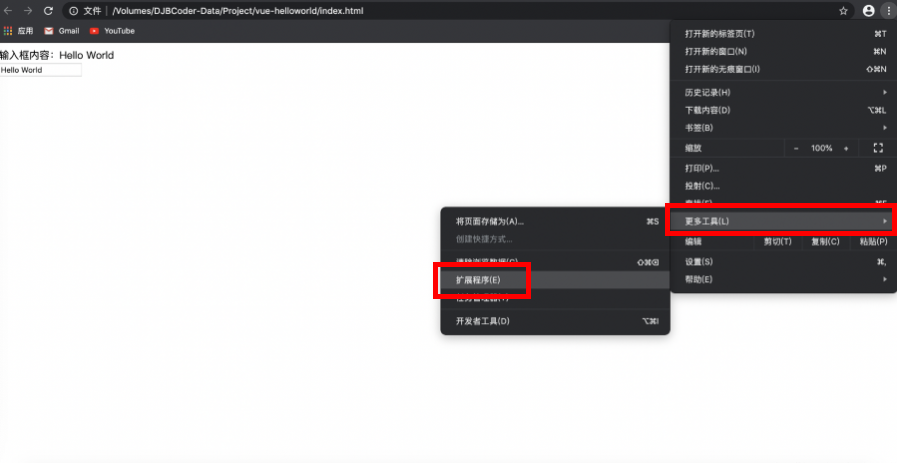

@[toc](VueJS介绍)

# Vue.js是什么

+ Vue是一套用于构建用户界面的渐进式框架，Vue被设计为自底向上逐层应用
  + 可以和传统的网站开发架构融合在一起，例如：可以简单地把它当作一个类似jQuery库
  + 也可以使用Vue全家桶框架来开发大型的单页面应用程序
+ 使用它的原因
  + 体积小，编码简介优雅，运行效率高，用户体验好
  + 无DOM操作，能提高网站应用程序的开发效率
+ 什么场景下使用
  + 一般是需要开发单页面应用程序的时候使用
  + 因为Vue是渐进式的，Vue其实可以融入到不同的项目中，即插即用

# 对比其他前端JS框架

+ Anglar 
  + 核心技术：模板和数据绑定技术
+ React
  + 核心技术：组件化和虚拟DOM技术
+ Vue.js
  + Vue不支持IE8及以下版本浏览器，因为Vue使用了IE8无法模拟的ECMAScript 5 的特性。

# 分析MVVM模型

+ MVVM是Model-View-ViewModel的缩写，是一种软件架构的风格
  + Model：模型，数据对象（Vue的data选项当中）
  + View：视图，模板页面（用于渲染数据）
  + ViewModel：视图模型，其实本质就是Vue实例
+ 它的思想是：通过数据驱动视图
  + 把需要改变视图的数据初始化到Vue中，然后再通过修改Vue中的数据，从而实现对视图的更新
+ 声明式编程和命令式编程
  + 声明式编程：按照Vue的特定语法进行声明式开发，就可以实现对应功能，不需要我们直接操作DOM元素
  + 命令式编程：jQuery就是，它需要手动去操作DOM才能实现对应功能


# 安装VueJS
## 直接使用script标签引入
&emsp;&emsp;尝试Vue.js最简单的方法是直接创建一个Html文件，然后通过script标签的方式引入vue.js文件。对于制作原型或者学习，可以直接使用CDN的方式引入最新版本：

```html
<script src="https://cdn.jsdelivr.net/npm/vue/dist/vue.js"></script>
```

&emsp;&emsp;对于生产环境，推荐链接到一个明确的版本号和构建文件，以避免版本造成的不可预期的破坏：

```html
<script src="https://cdn.jsdelivr.net/npm/vue@2.6.11"></script>
```

&emsp;&emsp;如果你使用原生ES Modules，这里也有一个兼容ES Modules的构建文件：

```html
<script type="module">
  import Vue from 'https://cdn.jsdelivr.net/npm/vue@2.6.11/dist/vue.esm.browser.js'
</script>
```

> *__也可以从网上下载最新版本的vue.js或者vue.min.js文件，然后通过本地相对路径的方式引入该文件__*

## NPM
&emsp;&emsp;在用Vue创建大型应用的时候推荐使用NPM安装，NPM能够很好地和诸如webpack或Browserify模块打包器配合使用，同时Vue也提供了配套工具来开发单文件组件。下面看一个通过NPM方式使用Vue的案例：

1. 创建项目目录 *__02-通过NPM使用Vue__*
2. 通过命令行的方式进入到项目目录 *__cd 02-通过NPM使用Vue__*
3. 使用 *__npm init__*  创建package.json文件

```json
{
  "name": "vue-demo",
  "version": "1.0.0",
  "description": "",
  "main": "index.js",
  "scripts": {
    "test": "echo \"Error: no test specified\" && exit 1"
  },
  "author": "DJBCoder",
  "license": "ISC"
}
```

4. 使用 *__npm install vue -S__*  下载Vue到本地，这时候会多出一个 *__node_modules__* 的文件目录和package-lock.json文件，并且package.json的文件改变了：

```json
{
  "name": "vue-demo",
  "version": "1.0.0",
  "description": "",
  "main": "index.js",
  "scripts": {
    "test": "echo \"Error: no test specified\" && exit 1"
  },
  "author": "DJBCoder",
  "license": "ISC",
  "dependencies": {
    "vue": "^2.6.11"
  }
}
```

5. 新建一个 *__index.html__* 的文件，在该文件中引入下载的vue.js文件：

```html
<!-- 02-通过npm的方式引入vue.js -->
<body>
    <script src="./node_modules/vue/dist/vue.js"></script>
</body>
```

## 命令行工具（CLI）
&emsp;&emsp;Vue提供了一个官方的CLI，为单页面应用（SPA）快速搭建复杂的脚手架，它为现代前端工作流提供了batteries-inclued的构建设置。只需要几分钟的时间就可以运行起来并带有热重载、保存时lint检验以及生产环境可用的构建版本。下面看一个使用脚手架创建Vue项目的过程：

> *__注意：确保已经全局安装了脚手架，如果没有安装，可以使用 npm install -g @vue/cli 命令下载__*

1. 使用 *__vue create 03-vue-cli-demo__* 的方式创建项目
2. 选择默认的方式创建项目


3. 等待项目安装完成


4. 通过命令进入到创建到的项目目录 *__cd 03-vue-cli-demo__*
5. 使用 *__npm run serve__*  命令运行项目
6. 使用谷歌浏览器打开网址访问网页，如：


# Hello World

&emsp;&emsp;下面通过一个Hello World程序看一下vue的使用过程：

1. 新建一个 "04-vue-helloworld"的目录
2. 进入项目目录，通过 *__npm init -y__* 初始化package.json文件
3. 通过 *__npm install vue -S__* 下载vue到本地
4. 编写index.html文件

+ 采用script标签引入vue.js库
+ 创建一个指定id为 "app" 的div标签
+ 使用 *__new Vue()__* 实例化一个Vue
  + el选项：指定Vue管理的DOM节点的入口（值为选择器），必须为一个普通的HTML标签节点，一般是div（*__注意：不能是html或者body标签__*）
  + data选项：指定初始化数据，在Vue所管理的DOM节点下
+ 标签中使用{{ xxx }}模板语法显示数据
+ 表单元素使用v-model双向绑定数据

&emsp;&emsp;完整代码如下：

```html
<!-- 04 Hello World -->
<body>
    <!-- 2. 创建一个id为app的div的标签 -->
    <div id="app">
        <!-- 通过模板绑定数据 -->
        <p>{{ message }}</p>

        <!-- 6. 通过v-model双向绑定数据 -->
        <input type="text" v-model="message">
    </div>

    <!-- 1. 引入vue.js库 -->
    <script src="./node_modules/vue/dist/vue.js"></script>
    <script>
        // 3. 创建Vue实例
        let app = new Vue({
            // 4. 通过el选项指定绑定的标签
            el: '#app',
            // 5. 通过data绑定数据
            data : {
                message: 'Hello World'
            }
        })
    </script>
</body>
```

5. 使用谷歌浏览器打开index.html查看效果（当输入文本框的内容改变的时候，页面上的显示的内容也会发生变化）


# Vue Devtools插件安装

&emsp;&emsp;Vue Devtools插件让我们在一个更友好的界面中审查和调试Vue项目。

1. 首先找到并打开Chrome浏览器的扩展程序的界面



2. 打开右上角的开发者模式


3. 将插件拖入到空白处


4. 安装成功后的效果图


5. 然后就可以在访问Vue开发的页面的时候打开开发者工具


6. 当看到下面的标签的时候，说明安装成功了

