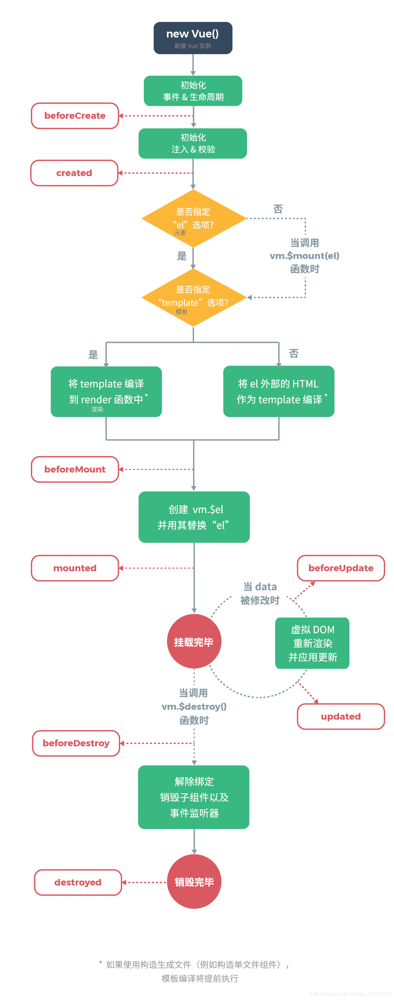
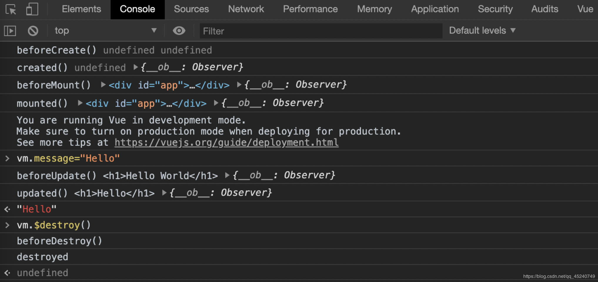

@[toc](Vue实例生命周期钩子)

# 生命周期钩子函数
&emsp;&emsp;每个Vue实例在被创建的时候都要经历一系列的初始化过程：设置数据监听、编译模板、将实例挂载到DOM并在数据变化时更新DOM等。同时在这个过程中也会运行一些叫做生命周期钩子的函数，可以在不同阶段添加自己的代码。

&emsp;&emsp;生命周期分为三大阶段：初始化显示、更新显示、销毁Vue实例。

+ 初始化阶段的钩子函数
  + beforeCreate()：实例创建前，数据和模板均未获取到
  + created()：实例创建后，最早可访问到data数据，但是模板未获取到
  + beforeMount()：数据挂载前，模板已经获取到，但是数据未挂载到模板上
  + mounted()：数据挂载后，数据已经挂载到模板中
+ 更新阶段的钩子函数
  + beforeUpdate()：模板更新前，data改变后，更新数据模板前调用
  + update()：模板更新后，将data渲染到数据模板中
+ 销毁阶段的钩子函数
  + beforeDestory()：实例销毁前
  + destoryed()：实例销毁后

> *__注意：__*
> 1. 生命周期钩子的this指向调用它的Vue实例
> 2. 不要在选项属性或回调上使用箭头函数，因为箭头函数并没有this，this会作为变量一直向上级作用域查找，直到找到为止，经常导致： *__Uncaught TypeError: Cannot read property of undefined__* 或者 *__Uncaught TypeError: this.myMethod is not a function__* 之类的错误

# 生命周期图示



# 示例演示

```html
<!-- 01-Vue实例生命周期钩子 -->
<body>
    <div id="app">
        <h1>{{ message }}</h1>
    </div>
    <script src="./node_modules/vue/dist/vue.js"></script>
    <script>
        let vm = new Vue({
            data: {
                message: 'Hello World'
            },
            beforeCreate() {
                // 创建前，啥都没有 beforeCreate() undefined undefined
                console.log('beforeCreate()', this.$el, this.$data) 
            },
            created() {
                // 已经初始化data，但是el还没有 created() undefined  {...}
                console.log("created()", this.$el, this.$data)
            },
            beforeMount() {
                // 模板获取到，数据也有，但是数据还没有挂载到模版 beforeMount() <div>...</div> {...}
                console.log("beforeMount()", this.$el, this.$data)
            },
            mounted() {
                // 模板获取到，数据也有，数据也挂载到模板
                console.log("mounted()", this.$el, this.$data)
            },
            beforeUpdate() {
                // 当data改变后，去更新模板中的数据前调用
                // 注意：浏览器问题，需要使用this.$el.innerHTML 获取更新前的Dom模板数据
                console.log("beforeUpdate()", this.$el.innerHTML, this.$data)
            },
            updated() {
                // data被Vue渲染之后的Dom数据模板
                console.log("updated()", this.$el.innerHTML, this.$data)
            },
            beforeDestroy() {
                // 销毁实例前调用
                console.log("beforeDestroy()")
            },
            destroyed() {
                // 销毁后调用
                console.log("destroyed")
            },
        }).$mount('#app')
    </script>
</body>
```

&emsp;&emsp;可以在控制检测运行结果：

