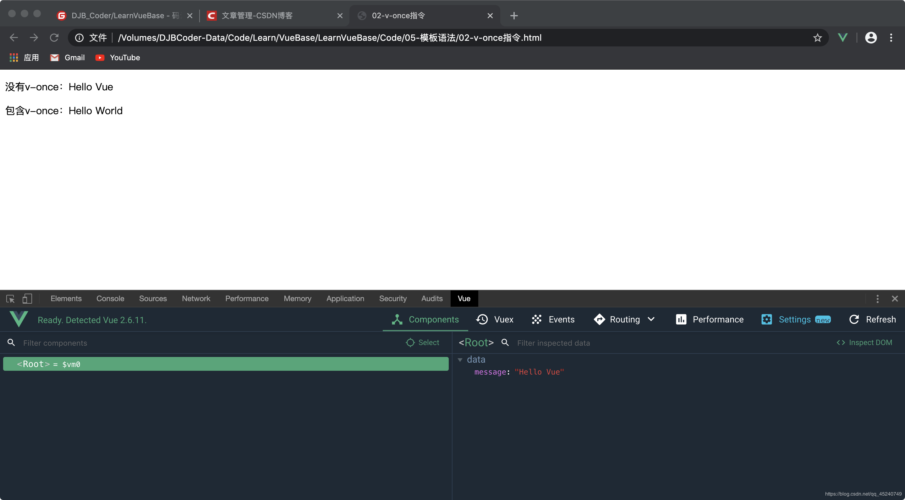

@[toc](模板语法)

# 简介
&emsp;&emsp;Vue.js使用了基于HTML的模板语法，允许开发者声明式的将DOM绑定至底层Vue实例的数据。所有Vue.js的模板都是合法的HTML，所以能被遵循规范的浏览器和HTML解析器解析。

&emsp;&emsp;在底层的实现上，Vue将模板编译成虚拟DOM渲染函数，结合响应系统，Vue能够智能地计算出最少需要重新渲染多少组件，并把DOM操作次数减少到最少。

+ {{ xxx }}：双大括号文本绑定
+ v-xxx：以 *__v-__* 开头用于标签属性绑定，称为指令

# 插值
## 文本
&emsp;&emsp;数据绑定最常见的形式就是使用"Mustache"语法（双大括号）的文本插值：

+ 格式：{{ 表达式 }}
+ 作用：
  + 使用在标签中，用于获取数据
  + 可以使用JavaScript表达式

```html
<!-- 01-Mustache语法 -->
<body>
    <div id="app">
        <p>{{ message }}</p>
    </div>
    <script src="./node_modules/vue/dist/vue.js"></script>
    <script>
        let app = new Vue({
            data: {
                message: 'Hello World'
            }
        }).$mount('#app')
    </script>
</body>
```

&emsp;&emsp;Mustache标签会将被替换为对象数据对象上的message属性，无论何时，绑定的数据对象上的message属性发生了变化，插值处的内容就会更新：


## v-once指令
&emsp;&emsp;通过v-once指令，你也能执行一次性地插值，当数据改变时，插值处的内容不会更新：

```html
<!-- 02-v-once指令 -->
<body>
    <div id="app">
        <p>没有v-once：{{ message }}</p>
        <p v-once>包含v-once：{{ message }}</p>
    </div>
    <script src="./node_modules/vue/dist/vue.js"></script>
    <script>
        let app = new Vue({
            data: {
                message: 'Hello World'
            }
        }).$mount('#app')
    </script>
</body>
```

&emsp;&emsp;此时无论在什么地方修改data中的数据，被v-once指定的标签都不会重新渲染数据：



## 显示原始HTML

+ 格式：v-html = "xxx"
+ 作用：
  + 如果是HTML格式的数据，双大括号会将数据解释为普通文本，使用v-html可以输出真正的HTML
  + Vue为防止XSS攻击，在此指令上做了安全处理，当发现输出的内容有script标签的时候则不渲染。（ *__XSS攻击主要是利用JS脚本注入到网页中，读取Cookie的值，这些值一般情况下存储了一些登陆身份信息__* ）

```html
<!-- 03-v-html指令的使用 -->
<body>
    <div id="app">
        <p>{{ contentHtml }}</p>
        <!-- 不会弹出对话框 -->
        <p v-html="contentHtml"></p>
    </div>
    <script src="./node_modules/vue/dist/vue.js"></script>
    <script>
        new Vue({
            data: {
                contentHtml: `
                <span style="color:red">
                    红色字体
                    <script>alert('Hello')<\/script>
                </span>
                `
            }
        }).$mount('#app')
    </script>
</body>
```


> *__注意：__*
> 1. 不能使用v-html来复合局部模板，因为Vue不是基于字符串的模板引擎
> 2. 对于用户界面，组件更适合作为可重用和可组合的基本单位
> 3. 在站点上动态渲染的任意HTML可能会非常危险，因为它很容易导致XSS攻击
> 4. 请只对可信内容使用HTML插值，绝不要对用户提供的内容使用插值

## Attribute
&emsp;&emsp;Mustache语法不能作用在HTML属性上，遇到这种情况应该使用v-bind指令。

```html
<!-- 04-v-bind的使用 -->
<body>
    <div id="app">
        <p v-bind:id="idStr">这里是一段文本</p>
    </div>
    <script src="./node_modules/vue/dist/vue.js"></script>
    <script>
        new Vue({
            data: {
                idStr: 'DJB'
            }
        }).$mount('#app')
    </script>
</body>
```

&emsp;&emsp;对于布尔属性（只要存在就意味着为true），v-bind工作起来略有不同：

```html
<!-- 05-绑定布尔属性 -->
<body>
    <div id="app">
        <button type="button"
        v-bind:disabled="isDisabled">按钮</button>
    </div>
    <script src="./node_modules/vue/dist/vue.js"></script>
    <script>
        new Vue({
            data: {
                isDisabled: null
            }
        }).$mount('#app')
    </script>
</body>
```

&emsp;&emsp;如果isDisabled的值是null、undefined或者false，则disabled属性甚至不会被包含在渲染出来的button元素中。

## 适应JavaScript表达式
&emsp;&emsp;对于所有数据的绑定，Vue.js都提供了完全的JavaScript表达式的支持：

```html
<!-- 06-使用JavaScript表达式 -->
<body>
    <div id="app">
        <!-- 算术表达式 -->
        <p> {{ number1 }} + {{ number2 }} = {{ number1 + number2 }} </p>
        <!-- 三元表达式 -->
        <p> {{ isOk ? '确定' : '取消' }} </p>
        <!-- 字符串运算 -->
        <p> {{ point.split(',').reverse().join(',') }} </p>
        <!-- 属性绑定的时候使用表达式 -->
        <button v-bind:disabled="!isDisabled">按钮</button>
    </div>
    <script src="./node_modules/vue/dist/vue.js"></script>
    <script>
        new Vue({
            data: {
                number1: 10,
                number2: 20,
                isOk: true,
                point: '123,456',
                isDisabled: false
            }
        }).$mount('#app')
    </script>
</body>
```

&emsp;&emsp;这些表达式会在所属Vue实例的数据作用域下作为JavaScript被解析，但是每个绑定都只能包含单个表达式，所以下面的例子都不会生效：

```html
<!-- 这是语句，不是表达式 -->
<p>{{ let a = 1 }}</p>

<!-- 流程控制也不会生效，请使用三元表达式 -->
<p>{{ if (ok) return message }}</p>
```

> *__注意：模板表达式都被放在沙盒中，只能访问全局变量的一个白名单，如：Math和Date。不能在模板表达式中试图访问用户定义的全局变量__*

# 指令
&emsp;&emsp;指令是带有v-前缀的特殊属性，指令属性的预期是单个JavaScript表达式（v-for是例外）。指令的职责是当表达式的值改变时，将其产生的连带影响，响应式地作用于DOM。

## 参数
&emsp;&emsp;一些指令能够接收一个"参数"，在指令名称之后以冒号表示，例如：v-bind指令可以响应式地更新HTML 属性：

```html
<!-- 07-v-bind参数 -->
<body>
    <div id="app">
        <a v-bind:href="url">百度</a>
    </div>
    <script src="./node_modules/vue/dist/vue.js"></script>
    <script>
        new Vue({
            data: {
                url: 'http://www.baidu.com'
            }
        }).$mount('#app')
    </script>
</body>
```

&emsp;&emsp;这里的href就是参数，告知v-bind指令将元素的href属性与表达式url的值绑定。

## 动态参数
&emsp;&emsp;从2.6.0开始，可以用方括号扩起来的JavaScript表达式作为一个指令的参数：

```html
<a v-bind:[attributeName]="url"></a>
```

&emsp;&emsp;这里attributeName会被作为一个JavaScript表达式进行动态求值，求的值将会作为最终的参数来使用。

```html
<!-- 08-动态参数 -->
<body>
    <div id="app">
        <a v-bind:[attributename]="url">百度</a>
    </div>
    <script src="./node_modules/vue/dist/vue.js"></script>
    <script>
        new Vue({
            data: {
                attributename: 'href',
                url: 'http://www.baidu.com'
            }
        }).$mount('#app')
    </script>
</body>
```

### 对动态参数的值的约束
&emsp;&emsp;动态参数预期会求出一个字符串，异常情况下值为null，这个特殊的null值可以被显性地用于移除绑定。任何其他非字符串类型的值都将会触发一个警告。

### 对动态参数表达式的约束

&emsp;&emsp;动态参数表达式有一些语法约束，因为某些字符，如空格和引号，放在HTML属性名里是无效的，例如：

```html
<!-- 这会触发一个编译警告 -->
<a v-bind:['foo' + bar]="value"></a>
```

&emsp;&emsp;变通的办法是使用没有空格或者引号的表达式，或者是使用计算属性替代这种复杂表达式。

&emsp;&emsp;在DOM中使用模板时（直接在一个HTML文件里撰写模板），还需要避免使用大写字符来命名，因为浏览器会把属性名全部强制转换为小写：

```html
<!-- DOM会转换为 'v-bind:[someattr]' -->
<a v-bind:[someAttr]="value"></a>
```

## 修饰符
&emsp;&emsp;修饰符是以半角句号"."指明的特殊后缀，用于指出一个指令应该以特殊方式绑定，例如：.prevent修饰符告诉v-on指令对于触发的事件调用event.preventDefault()方法：

```html
<!-- 09-修饰符 -->
<body>
    <div id="app">
        <!-- 不会跳转网页，只是弹出对话框 -->
        <a href="http://www.baidu.com"
        v-on:click.prevent="handleClick">
        百度</a>
    </div>
    <script src="./node_modules/vue/dist/vue.js"></script>
    <script>
        new Vue({
            methods: {
                handleClick () {
                    alert('Hello World')
                }
            },
        }).$mount('#app')
    </script>
</body>
```

# 缩写
&emsp;&emsp;Vue为v-bind和v-on提供了特定的简写。

## 元素绑定指令 v-bind

+ 完整格式：v-bind: 属性名 = "xxx"
+ 缩写格式：:属性名 = "xxx"
+ 作用：将数据动态绑定到指定的元素属性上

```html
<!-- 10-v-bind缩写 -->
<body>
    <div id="app">
        <a :href="url">百度</a>
    </div>
    <script src="./node_modules/vue/dist/vue.js"></script>
    <script>
        new Vue({
            data: {
                url: 'http://www.baidu.com'
            }
        }).$mount('#app')
    </script>
</body>
```

## 事件绑定指定 v-on

+ 完整格式：v-on: 事件名 = '事件处理函数'
+ 缩写格式：@事件名="事件处理函数"
+ 作用：用于监听DOM事件

```html
<!-- 11-v-on缩写 -->
<body>
    <div id="app">
        <button @click="handleClick">按钮</button>
    </div>
    <script src="./node_modules/vue/dist/vue.js"></script>
    <script>
        new Vue({
            methods: {
                handleClick () {
                    alert('Hello World')
                }
            },
        }).$mount('#app')
    </script>
</body>
```

