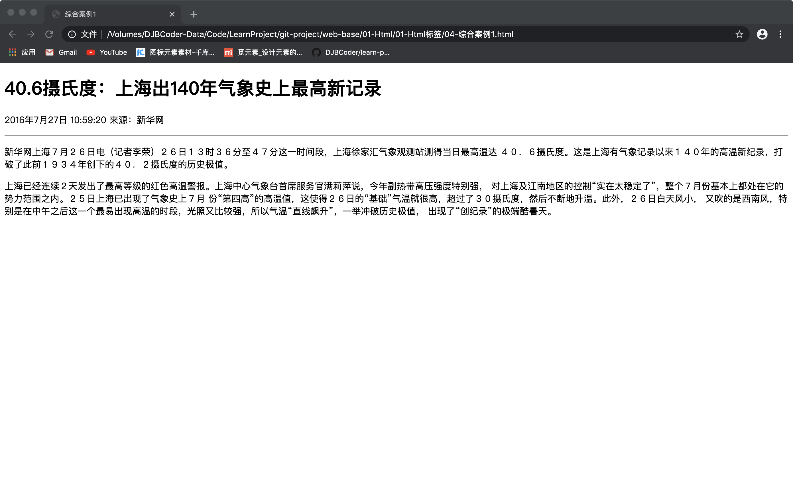

@[toc](Html标签)

# 排版标签
&emsp;&emsp;排版标签主要和css搭配使用，显示网页结构的标签，是网页布局最常用的标签。

## 标题标签
&emsp;&emsp;为了使网页更具有语义化，我们经常会在页面中用到标题标签，HTML提供了6个等级的标题，即：&lt;h1&gt;、&lt;h2&gt;、&lt;h3&gt;、&lt;h4&gt;、&lt;h5&gt;和&lt;h6&gt;

+ 标题标签语义：作为标题使用，并且依据重要性递减
+ 基本语法格式如下：

```html
<hn>标题文本</hn>
```

> *__注意：h1标签因为重要，尽量少用，一般h1都是给logo使用。__*

&emsp;&emsp;示例：

```html
<!-- 01-标题标签 -->
<body>
    <h1>这是h1标签</h1>
    <h2>这是h2标签</h2>
    <h3>这是h3标签</h3>
    <h4>这是h4标签</h4>
    <h5>这是h5标签</h5>
    <h6>这是h6标签</h6>
</body>
```

## 段落标签
&emsp;&emsp;在网页中要把文字有条理地显示出来，离不开段落标签，就如同我们平常写文章一样，整个网页也可以分为若干个段落。

```html
<!-- 02-段落标签 -->
<body>
    <p>这是一个段落。</p>
    <p>这是另外一个段落</p>
</body>
```

&emsp;&emsp;p标签是HTML文档中最常见的标签，默认情况下，文本在一个段落中会根据浏览器窗口的大小自动换行。

## 水平线标签
&emsp;&emsp;在网页中常常看到一些水平线将段落与段落之间隔开，使得文档结构清晰，层次分明。这些水平线可以通过插入图片实现，也可以简单地通过标签来完成，&lt;hr/&gt;就是创建横跨网页水平线的标签，其基本语法格式如下：

```html
<!-- 水平线标签 -->
<body>
    <h2>这里是标题</h2>
    <!-- 这是一个单标签 -->
    <hr />
    <p>这是一个段落</p>
</body>
```

&emsp;&emsp;综合示例：

```html
<!-- 04-综合案例1 -->
<body>
    <h1>40.6摄氏度：上海出140年气象史上最高新记录</h1>
    <p>2016年7月27日 10:59:20 来源：新华网</p>
    <hr />
    <p>新华网上海７月２６日电（记者李荣）２６日１３时３６分至４７分这一时间段，上海徐家汇气象观测站测得当日最高温达
    ４０．６摄氏度。这是上海有气象记录以来１４０年的高温新纪录，打破了此前１９３４年创下的４０．２摄氏度的历史极值。</p>

    <p>上海已经连续２天发出了最高等级的红色高温警报。上海中心气象台首席服务官满莉萍说，今年副热带高压强度特别强，
    对上海及江南地区的控制“实在太稳定了”，整个７月份基本上都处在它的势力范围之内。２５日上海已出现了气象史上７月
    份“第四高”的高温值，这使得２６日的“基础”气温就很高，超过了３０摄氏度，然后不断地升温。此外，２６日白天风小，
    又吹的是西南风，特别是在中午之后这一个最易出现高温的时段，光照又比较强，所以气温“直线飙升”，一举冲破历史极值，
    出现了“创纪录”的极端酷暑天。</p>
</body>
```

&emsp;&emsp;显示的结果如下：



## 换行标签
&emsp;&emsp;在HTML中，一个段落中的文字会从左到右依次排列，直到浏览器窗口的右端，然后自动换行。如果希望某段文本强制换行显示，就需要使用换行标签br：

```html
<!-- 05-换行标签 -->
<body>
    <h2>---- 中国4大名著 -----</h2>
    1. 《水浒传》 <br>
    2. 《西游记》 <br>
    3. 《水浒传》 <br>
    4. 《三国演义》
</body>
```

> *__如果还像在word中那样直接敲回车键换行是不起作用的。__*

## div span标签
&emsp;&emsp;div和span标签是没有语义的，是网页布局主要的2个盒子：

+ div：就是division的缩写，是分割、分区的意思，其实有很多div来组合网页。
+ span：跨度，跨距；范围

```html
<!-- 06-div和span标签 -->
<body>
    <div>这里是一个div标签</div>
    <div>这里是一个div标签</div>
    <span>这里是一个span标签</span>
    <span>这里是一个span标签</span>
</body>
```

> *__注意：div会自动成一行，span不会__*

# 文本格式化标签
&emsp;&emsp;在网页中，有时需要为文字设置粗体、斜体或下划线效果，这时就需要用到HTML中的文本格式化标签，使文字以特殊的方式显示：

标签 | 显示效果   
-|-
&lt;b&gt;&lt;/b&gt;、&lt;strong&gt;&lt;/strong&gt; | 文字以粗体的方式显示 |
&lt;i&gt;&lt;/i&gt;、&lt;em&gt;&lt;/em&gt; | 文字以斜体的方式显示 |
&lt;s&gt;&lt;/s&gt;、&lt;del&gt;&lt;/del&gt; | 文字以加删除线的方式显示 |
&lt;u&gt;&lt;/u&gt;、&lt;ins&gt;&lt;/ins&gt; | 文字以加下划线的方式显示 |

```html
<!-- 07-文本格式化标签 -->
<body>
    <b>使用 b 标签加粗</b><br>
    <strong>使用 strong  标签加粗</strong><br>
    <i>使用 i 标签倾斜</i><br>
    <em>使用 em 标签倾斜</em><br>
    <s>使用 s 标签 加删除线</s><br>
    <del>使用 del 标签加删除线</del><br>
    <u>使用 u 标签添加下划线</u><br>
    <ins> 使用 ins 标签添加下划线</ins>
</body>
```

> b、i、s、u标签只有使用没有强调的意思，strong、em、del、ins语义更强烈。

# 标签属性
&emsp;&emsp;属性就是特性，比如：手机的颜色、手机的尺寸等等。使用HTML制作网页时，如果想让HTML标签提供更多的信息，可以使用HTML标签的属性加以设置。其基本语法格式如下：

```html
<标签名 属性1="属性值1" 属性2="属性值2" …> 内容 </标签名>
```

&emsp;&emsp;在上面的语法中：

1. 标签可以拥有多个属性，必须写在开始标签中且位于标签名后面。
2. 属性之间不分先后顺序，标签名与属性、属性与属性之间均以空格分开。
3. 任何标签的属性都有默认值，省略该属性则取默认值。
4. 采取键值对的格式 *__key="value"__* 的格式：

```html
<hr width="400" />
```

> *__注意：尽量不使用样式属性，应该交给css去处理。__*

# 图像标签
&emsp;&emsp;HTML网页中任何元素的实现都要依靠HTML标签，要想在网页中显示图像就需要使用图像标签&lt;img /&gt;以及和他相关的属性。其基本语法格式如下：

```html

```

&emsp;&emsp;该语法中src属性用于指定图像文件的路径和文件名，它是img标签的必需属性。img标签的属性说明如下：

属性| 属性值| 描述
-|-|-
src | URL | 图像的路径
alt | 文本 | 图像不能显示时候的替换文本
title | 文本 | 鼠标悬停的时候的内容
width | 像素 | 图像的宽度
height | 像素 | 图像的高度
border | 数字 | 图像边框的宽度

> *__注意：一般情况下值需要修改宽度和高度中的其中一项，剩下的那个会等比例缩放__*

```html
<!-- 08-图片标签 -->
<body>
    
</body>
```

# 特殊字符标签

特殊字符 | 描述 | 字符的代码
-|-|-
|空格符|\&nbsp;
&lt;|小于号|\&lt;
&gt;|大于号|\&gt;
&amp;|和好|\&amp;
&yen;|人民币|\&yen;
&copy;|版权|\&copy;
&reg;|注册商标|\&reg;
&deg;|摄氏度|\&deg;
&plusmn;|正负号|\&plusmn;
&times;|乘号|\&times;
&divide;|除号|\&divide;
&sup2;|平方2|\&sup2;
&sup3;|立方3|\&sup3;

# 注释标签
&emsp;&emsp;在HTML中还有一种特殊的标签：注释标签。如果需要在HTML文档中添加一些便于阅读和理解但又不需要显示在页面中的注释文字，就需要使用注释标签。其基本语法格式如下：
​
```html
<!-- 注释语句 -->
```

&emsp;&emsp;注释内容不会显示在浏览器窗口中，但是作为HTML文档内容的一部分，也会被下载到用户的计算机上，查看源代码时就可以看到。