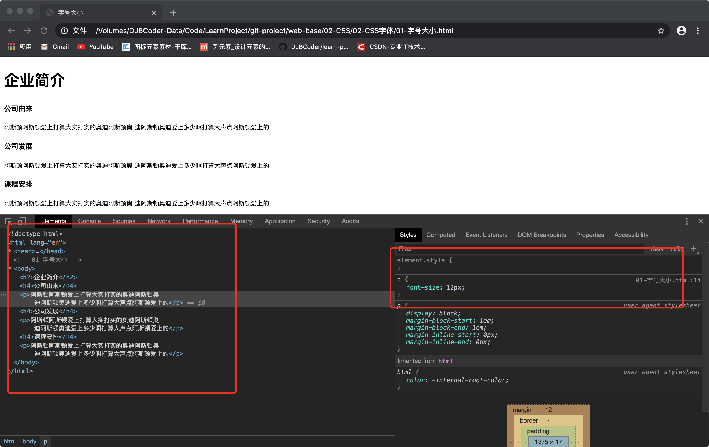

@[toc](初识CSS)

# CSS的发展历程
&emsp;&emsp;从HTML被发明开始，样式就以各种形式存在。不同的浏览器结合它们各自的样式语言为用户提供页面效果的控制。最初的HTML只包含很少的显示属性。随着HTML的成长，为了满足页面设计者的要求，HTML添加了很多显示功能。但是随着这些功能的增加，HTML变的越来越杂乱，而且HTML页面也越来越臃肿。于是CSS便诞生了。

# CSS 网页的美容师
&emsp;&emsp;CSS的出现，拯救了混乱的HTML。CSS的最大贡献就是：让HTML从样式中解脱出来，实现了HTML专注去做结构呈现，而样式交给CSS。

# CSS初识
&emsp;&emsp;CSS(Cascading Style Sheets)通常称为CSS样式表或层叠样式表（级联样式表），主要用于设置HTML页面中的文本内容（字体、大小、对齐方式等）、图片的外形（宽高、边框样式、边距等）以及版面的布局等外观显示样式。

&emsp;&emsp;CSS以HTML为基础，提供了丰富的功能，如字体、颜色、背景的控制及整体排版等，而且还可以针对不同的浏览器设置不同的样式。

## CSS样式规则
&emsp;&emsp;使用HTML时，需要遵从一定的规范。CSS亦如此，要想熟练地使用CSS对网页进行修饰，首先需要了解CSS样式规则，具体格式如下：


&emsp;&emsp;在上面的样式规则中:

1. 选择器用于指定CSS样式作用的HTML对象，花括号内是对该对象设置的具体样式。
2. 属性和属性值以“键值对”的形式出现。
3. 属性是对指定的对象设置的样式属性，例如字体大小、文本颜色等。
4. 属性和属性值之间用英文“:”连接。
5. 多个“键值对”之间用英文“;”进行区分。

## CSS注释
&emsp;&emsp;CSS的注释和HTML注释的作用相同，格式如下：

```css
/* 注释的内容 */
```

# 开发者工具（chrome）
&emsp;&emsp;这是前端开发的必备工具，以后代码出了问题，就可以打开它进行查看，打开方式如下：

+ “按F12”或者是 “shift+ctrl+i”打开开发者工具
+ 右击网页空白在弹出的对话框中选择“查看”



> *__小技巧__*
> 1. ctrl+滚轮可以放大开发者工具代码大小。
> 2. 左边是HTML元素结构，右边是CSS样式。
> 3. 右边CSS样式可以改动数值和颜色查看更改后效果。